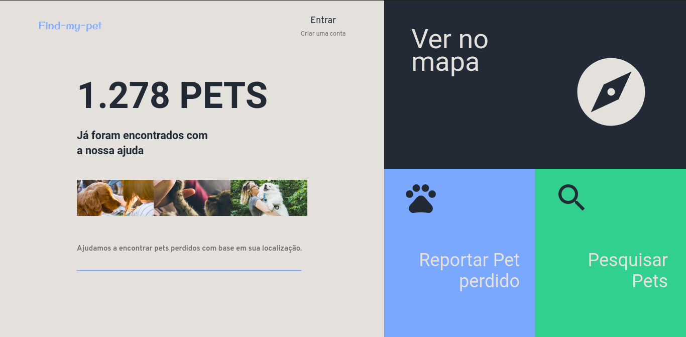

# Find My Pet

<p align="center">
  <a href="#about-project">About project</a>&nbsp;&nbsp;&nbsp;|&nbsp;&nbsp;&nbsp;
  <a href="#technologies">Technologies</a>&nbsp;&nbsp;&nbsp;|&nbsp;&nbsp;&nbsp;
  <a href="#getting-started">Getting started</a>&nbsp;&nbsp;&nbsp;&nbsp;&nbsp;&nbsp;
</p>

  
  
## About project

Application created to help localize lost pets, based on location. 
To report the lost pet, users must provide the last location the pet was seen.The pet's name, description and upload a photo.
Anyone who has information on the lost pet reported can contact the pet's responsible via app.

---

  ### Map Page
  

  ### Search Page
  

  ### Report Page
  

## Technologies

### Back-end: [Node.js](https://nodejs.org/en/), [PostgreSQL](https://www.postgresql.org/), [Docker](https://www.docker.com/)
### Web:[ReactJS](https://reactjs.org/), [Styled-components](https://styled-components.com/)
[TypeScript](https://www.typescriptlang.org/)
 
---

## Getting started


### Requirements

- [Node.js](https://nodejs.org/en/)
- [Yarn](https://classic.yarnpkg.com/)
- [Expo](https://expo.io/)
- [Docker](https://www.docker.com/)

**Install dependencies**

```sh
$ yarn
```


### Backend

```sh
$ yarn dev:server
```

### Web

```sh
$ yarn web start
Start client, be sure if server (backend) is running
```
